# Диаграмма базы данных EcoSteps

## ER-диаграмма (Entity-Relationship Diagram)

```mermaid
erDiagram
    %% Основные таблицы
    genders ||--o{ users : "имеет"
    users ||--o{ user_settings : "имеет"
    users ||--o{ user_posts : "создает"
    users ||--o{ post_comments : "пишет"
    users ||--o{ post_likes : "лайкает"
    users ||--o{ success_stories : "создает"
    users ||--o{ story_likes : "лайкает"
    users ||--o{ friendships : "дружит"
    users ||--o{ user_reports : "жалуется"
    users ||--o{ notifications : "получает"
    users ||--o{ user_achievements : "получает"
    users ||--o{ eco_coins_history : "зарабатывает"
    users ||--o{ achievement_events : "генерирует"
    users ||--o{ support_tickets : "создает"
    users ||--o{ user_activities : "совершает"
    users ||--o{ user_eco_tips : "просматривает"
    users ||--o{ team_members : "участвует"
    users ||--o{ ban_history : "банится"
    users ||--o{ carbon_calculations : "рассчитывает"
    users ||--o{ user_carbon_goals : "ставит"
    users ||--o{ user_carbon_analytics : "анализирует"
    users ||--o{ user_calculator_settings : "настраивает"
    
    %% Посты и комментарии
    user_posts ||--o{ post_comments : "имеет"
    user_posts ||--o{ post_likes : "имеет"
    
    %% Истории
    success_stories ||--o{ story_likes : "имеет"
    
    %% Достижения
    achievements ||--o{ user_achievements : "выдается"
    achievements ||--o{ eco_coins_history : "награждает"
    
    %% Команды
    teams ||--o{ team_members : "включает"
    
    %% Эко-советы
    eco_tips ||--o{ user_eco_tips : "просматривается"
    
    %% Калькулятор
    calculator_categories ||--o{ user_carbon_goals : "используется"
    
    %% Структура таблиц
    genders {
        int id PK
        varchar code UK "male/female"
    }
    
    users {
        int id PK
        varchar email UK
        varchar nickname UK
        varchar password_hash
        date date_of_birth
        int gender_id FK
        text bio
        text goal
        int trees_planted
        int carbon_saved
        varchar eco_level
        varchar avatar_emoji
        boolean email_verified
        boolean is_profile_public
        boolean is_banned
        text ban_reason
        timestamp ban_expires_at
        int ban_count
        boolean is_admin
        int eco_coins
        timestamp created_at
        timestamp updated_at
        timestamp last_login_at
        timestamp deleted_at
    }
    
    user_settings {
        int id PK
        int user_id FK
        varchar theme
        varchar language
        boolean notifications_enabled
        boolean eco_tips_enabled
        int privacy_level
        varchar timezone
        timestamp created_at
        timestamp updated_at
    }
    
    user_posts {
        int id PK
        int user_id FK
        text content
        int likes_count
        int comments_count
        timestamp created_at
        timestamp updated_at
        timestamp deleted_at
    }
    
    post_comments {
        int id PK
        int post_id FK
        int user_id FK
        text content
        timestamp created_at
        timestamp updated_at
        timestamp deleted_at
    }
    
    post_likes {
        int id PK
        int post_id FK
        int user_id FK
        timestamp created_at
    }
    
    success_stories {
        int id PK
        int user_id FK
        varchar title
        text content
        varchar category
        decimal carbon_saved
        int likes_count
        varchar status
        timestamp created_at
        timestamp updated_at
    }
    
    story_likes {
        int id PK
        int story_id FK
        int user_id FK
        timestamp created_at
    }
    
    friendships {
        int id PK
        int user_id FK
        int friend_id FK
        varchar status
        timestamp created_at
        timestamp updated_at
    }
    
    user_reports {
        int id PK
        int reporter_id FK
        int reported_user_id FK
        text reason
        text description
        text[] screenshots
        varchar status
        text admin_notes
        text admin_response
        int reviewed_by FK
        timestamp reviewed_at
        timestamp created_at
        timestamp updated_at
    }
    
    notifications {
        int id PK
        int user_id FK
        varchar type
        varchar title
        text message
        varchar link
        boolean is_read
        int related_id
        timestamp created_at
    }
    
    achievements {
        int id PK
        varchar code UK
        varchar name
        text description
        varchar category
        varchar icon
        varchar event_type
        varchar requirement_type
        int requirement_value
        int points
        varchar rarity
        boolean is_active
        boolean is_hidden
        int sort_order
        timestamp created_at
        timestamp updated_at
    }
    
    user_achievements {
        int id PK
        int user_id FK
        int achievement_id FK
        int progress
        int current_value
        boolean completed
        timestamp started_at
        timestamp completed_at
        timestamp claimed_at
        jsonb metadata
        timestamp created_at
        timestamp updated_at
    }
    
    eco_coins_history {
        int id PK
        int user_id FK
        int amount
        varchar type
        int achievement_id FK
        text description
        timestamp created_at
    }
    
    achievement_events {
        int id PK
        int user_id FK
        varchar event_type
        jsonb event_data
        boolean processed
        timestamp created_at
    }
    
    support_tickets {
        int id PK
        int user_id FK
        varchar ticket_number UK
        varchar subject
        text message
        varchar status
        text admin_response
        timestamp responded_at
        timestamp created_at
        timestamp updated_at
    }
    
    user_activities {
        int id PK
        int user_id FK
        varchar activity_type
        text description
        int related_id
        int carbon_saved
        timestamp created_at
    }
    
    eco_tips {
        int id PK
        varchar title
        text content
        varchar category
        varchar difficulty
        int co2_impact
        int day_of_year
        timestamp created_at
    }
    
    user_eco_tips {
        int id PK
        int user_id FK
        int tip_id FK
        timestamp viewed_at
        boolean liked
    }
    
    teams {
        int id PK
        varchar name UK
        text description
        varchar avatar_emoji
        text goal_description
        int goal_target
        int goal_current
        int carbon_saved
        int member_count
        timestamp created_at
        timestamp updated_at
    }
    
    team_members {
        int id PK
        int team_id FK
        int user_id FK
        varchar role
        timestamp joined_at
    }
    
    ban_history {
        int id PK
        int user_id FK
        text reason
        int duration_hours
        boolean is_permanent
        int created_by FK
        timestamp created_at
        timestamp unbanned_at
        text unban_reason
        int unbanned_by FK
    }
    
    calculator_categories {
        int id PK
        varchar code UK
        varchar name
        text description
        varchar icon
        varchar unit
        decimal baseline_value
        decimal min_value
        decimal max_value
        decimal weight
        boolean is_active
        int sort_order
        timestamp created_at
        timestamp updated_at
    }
    
    user_calculator_settings {
        int id PK
        int user_id FK
        decimal baseline_footprint
        int carbon_goal_percent
        date target_deadline
        boolean notify_on_goal_progress
        boolean notify_monthly_report
        boolean auto_calculate
        varchar preferred_units
        varchar default_period
        timestamp created_at
        timestamp updated_at
    }
    
    carbon_calculations {
        int id PK
        int user_id FK
        date calculation_date
        decimal total_footprint
        decimal co2_saved
        boolean is_baseline
        jsonb categories
        jsonb input_data
        jsonb recommendations
        varchar calculation_method
        varchar data_source
        uuid session_id
        text notes
        timestamp created_at
        timestamp updated_at
    }
    
    user_carbon_goals {
        int id PK
        int user_id FK
        varchar goal_type
        varchar title
        text description
        decimal target_value
        decimal current_value
        varchar unit
        varchar category_code FK
        date start_date
        date end_date
        varchar status
        int progress_percent
        boolean is_recurring
        varchar recurrence_pattern
        timestamp created_at
        timestamp updated_at
    }
    
    user_carbon_analytics {
        int id PK
        int user_id FK
        date period_start
        date period_end
        varchar period_type
        int calculations_count
        decimal avg_footprint
        decimal total_savings
        decimal monthly_savings
        jsonb category_analysis
        varchar best_category
        varchar worst_category
        varchar footprint_trend
        varchar savings_trend
        jsonb generated_recommendations
        timestamp calculated_at
    }
```

## Описание основных связей

### Пользователи и социальные функции
- **users** ↔ **friendships**: Пользователи могут дружить друг с другом (many-to-many через friendships)
- **users** → **user_posts**: Пользователи создают посты (one-to-many)
- **user_posts** → **post_comments**: Посты имеют комментарии (one-to-many)
- **user_posts** → **post_likes**: Посты можно лайкать (one-to-many)

### Истории успеха
- **users** → **success_stories**: Пользователи создают истории (one-to-many)
- **success_stories** → **story_likes**: Истории можно лайкать (one-to-many)

### Система достижений
- **achievements**: Справочник всех достижений
- **user_achievements**: Прогресс пользователей по достижениям
- **achievement_events**: События для отслеживания прогресса
- **eco_coins_history**: История начисления экоинов за достижения

### Команды
- **teams**: Команды пользователей
- **team_members**: Участники команд (many-to-many связь users ↔ teams)

### Калькулятор углеродного следа
- **calculator_categories**: Категории для расчета (транспорт, еда, энергия и т.д.)
- **carbon_calculations**: История расчетов пользователя
- **user_carbon_goals**: Цели по снижению углеродного следа
- **user_carbon_analytics**: Аналитика и тренды
- **user_calculator_settings**: Персональные настройки калькулятора

### Модерация и поддержка
- **user_reports**: Жалобы на пользователей
- **ban_history**: История банов
- **support_tickets**: Обращения в поддержку
- **notifications**: Уведомления пользователей

### Эко-советы
- **eco_tips**: Ежедневные советы
- **user_eco_tips**: Просмотренные советы пользователем

## Ключевые особенности БД

1. **Мягкое удаление**: Поля `deleted_at` в таблицах users, user_posts, post_comments
2. **Временные метки**: Все таблицы имеют `created_at` и `updated_at`
3. **JSONB поля**: Используются для гибкого хранения данных (metadata, categories, event_data)
4. **Индексы**: Созданы для оптимизации частых запросов
5. **Триггеры**: Автоматическое обновление `updated_at`, создание настроек пользователя
6. **Представления (Views)**: Для удобного получения агрегированных данных

## Статистика

- **Основных таблиц**: 30+
- **Индексов**: 50+
- **Представлений**: 7
- **Функций**: 5+
- **Триггеров**: 3+
